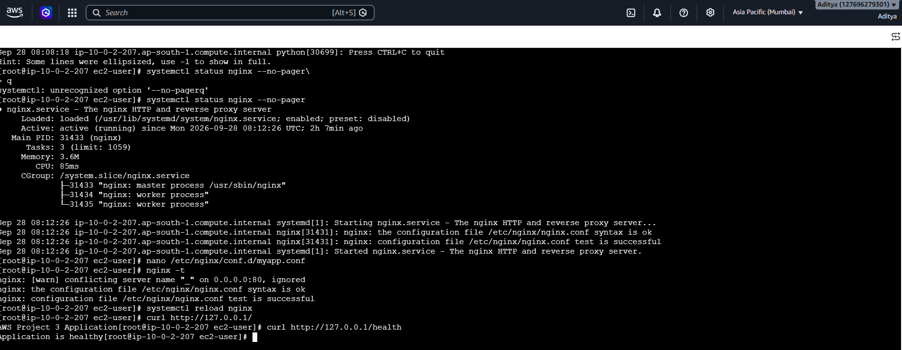
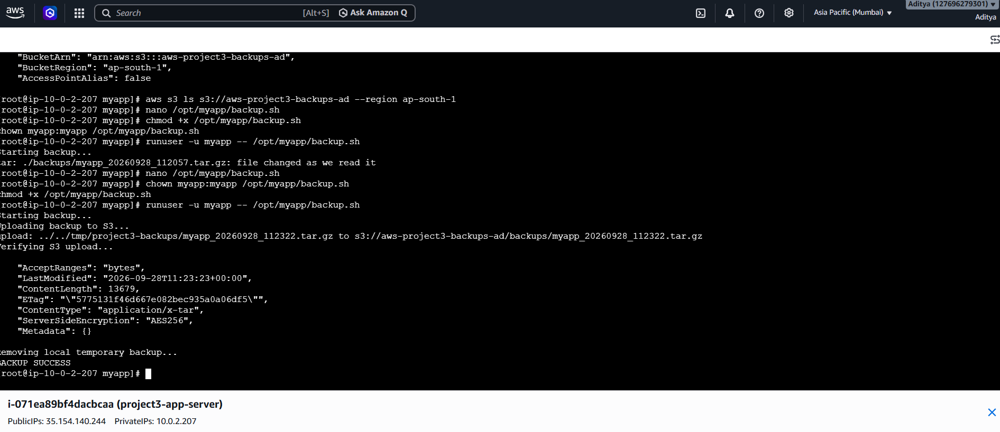
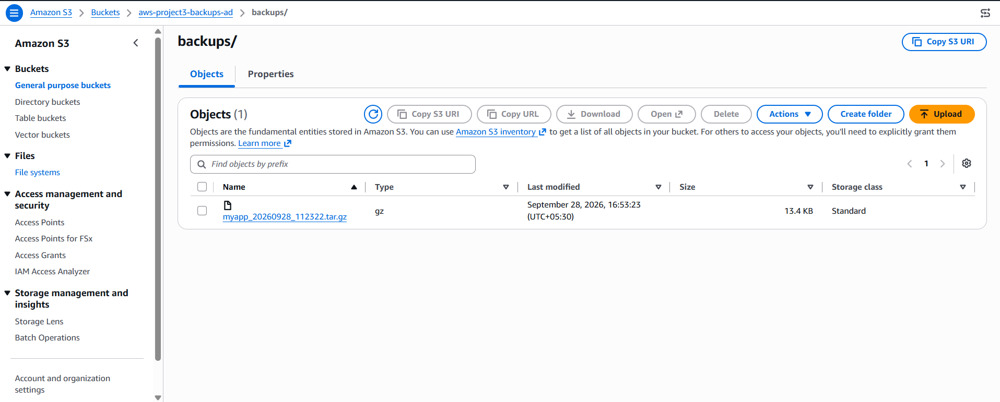

# aws-project3-app-deployment-automation

End-to-end application deployment and automation on AWS using EC2, Linux, Nginx, systemd, Bash, GitHub and Amazon S3.

# AWS Project 3 — End-to-End Application Deployment and Automation

## Project Overview

This project demonstrates an end-to-end application deployment workflow using:

- Amazon EC2
- Linux
- Nginx
- GitHub
- systemd
- Bash
- Amazon S3
- IAM
- Application health checks

The objective was to take a simple application from source code to a running AWS environment and implement deployment automation, reverse proxying, service management, backup automation and troubleshooting.

The project follows the engineering cycle:

```text
Requirement
    ↓
Architecture
    ↓
Implementation
    ↓
Validation
    ↓
Failure Testing
    ↓
Troubleshooting
    ↓
Documentation
```

---

## Architecture

[AWS Project 3 Architecture Diagram](https://github.com/Aditya111328/aws-project3-app-deployment-automation/blob/main/architecture-diagram.png)


### Traffic Flow

```text
Developer
    |
    v
 GitHub
    |
    v
 deploy.sh
    |
    v
 AWS EC2 Linux
    |
    v
 Nginx :80
    |
    v
 Application
    |
    v
 systemd Service
    |
    +------------------+
    |                  |
    v                  v
 Application Logs     Health Check
    |
    v
 backup.sh
    |
    v
 Amazon S3
```

The application runs internally on the EC2 instance while Nginx acts as the public entry point and reverse proxy.

---

## AWS Services Used

| AWS Service | Purpose |
|---|---|
| Amazon EC2 | Hosts the Linux application server |
| Amazon VPC | Provides network isolation |
| Security Group | Controls inbound and outbound network access |
| Amazon S3 | Stores application backups |
| IAM | Provides controlled AWS permissions for EC2 |

---

## EC2 Instance

A Linux EC2 instance was created to host the application and supporting services.


The EC2 server was configured with the required Linux tools and services for application deployment.

---

## Linux Application Setup

The application was deployed on the EC2 Linux server and configured to run as a managed service.

The application was separated from the public-facing Nginx layer.

### Application Flow

```text
Internet
   |
   v
Nginx :80
   |
   v
Application
   |
   v
Local Application Port
```

This prevents the application service from needing to act as the public entry point.

---

## Nginx Reverse Proxy

Nginx was configured as a reverse proxy in front of the application.

The purpose of the reverse proxy is to accept HTTP requests on port `80` and forward them to the locally running application.

### Reverse Proxy Flow

```text
Client
  |
  | HTTP :80
  v
Nginx
  |
  | Proxy Request
  v
Application
```

### Application Through Nginx

The application was successfully accessed through Nginx.


This confirmed that:

- Nginx was running
- Nginx was accepting HTTP requests
- Nginx could communicate with the application
- The application was reachable through the reverse proxy

---

## Nginx Reverse Proxy Validation

The reverse proxy configuration was tested to verify that Nginx correctly forwarded requests to the application.



The test confirmed successful communication between the Nginx reverse proxy and the application.

---

## Nginx Recovery Testing

Nginx failure and recovery were tested as part of the troubleshooting process.


The service was restored and the application became accessible again after Nginx recovery.

---

## systemd Service

The application was configured as a Linux `systemd` service.

Using systemd provides service management capabilities such as:

- Starting the application
- Stopping the application
- Checking service status
- Automatic service recovery
- Starting the application after reboot

### Check Service Status

```bash
sudo systemctl status myapp
```

### Check Service State

```bash
sudo systemctl is-active myapp
```

Expected result:

```text
active
```

### Enable Service at Boot

```bash
sudo systemctl enable myapp
```

This allows the application service to start automatically when the EC2 instance boots.

---

## systemd Service Validation

The application service was successfully configured and validated using systemd.


The screenshot demonstrates the application service running under systemd.

---

## systemd Recovery Testing

The application service was intentionally interrupted to verify service recovery.


The recovery test demonstrated that systemd could restore the application service after failure.

---

## Deployment Automation

A Bash deployment script named `deploy.sh` was used to automate the application deployment process.

The deployment process follows a controlled sequence:

```text
Validate prerequisites
        ↓
Pull latest approved code
        ↓
Install / update dependencies
        ↓
Validate configuration
        ↓
Restart application service
        ↓
Check service status
        ↓
Run health check
        ↓
Return SUCCESS / FAILED
```

The goal is to reduce manual deployment steps and provide a repeatable deployment process.

The project requirement also emphasizes validating the new code and configuration before taking down a working application. :contentReference[oaicite:2]{index=2}

---

## Deployment Validation

The deployment automation was executed successfully.


The successful deployment confirmed that the deployment workflow completed without errors and that the application service was available after deployment.

---

## Application Health Check

Application health checks are used to verify that the application is responding after deployment.

A health check provides a simple way to distinguish between:

```text
Service Running
        |
        v
Application Responding
        |
        v
Application Healthy
```

The project specification recommends using a `/health` endpoint for this purpose. :contentReference[oaicite:3]{index=3}

---

## Backup Automation

A Bash backup script named `backup.sh` was used to automate application backup operations.

The backup workflow follows:

```text
Application / Configuration
        |
        v
Timestamped Backup
        |
        v
Upload to S3
        |
        v
Verify Upload
```

The backup process is designed to:

- Create a timestamped archive
- Upload the archive to Amazon S3
- Verify that the upload succeeded
- Maintain local backup retention

The project specification also requires avoiding hardcoded AWS access keys and recommends using an EC2 IAM role where possible. :contentReference[oaicite:4]{index=4}

---

## Backup Script Validation

The backup script was executed successfully.



The screenshot shows successful execution of the backup process.

---

## S3 Backup Validation

The generated backup was uploaded to Amazon S3.



The S3 bucket was verified to contain the uploaded backup artifact.

This confirms that the backup workflow successfully transferred the backup from the EC2 server to Amazon S3.

---

## Security Considerations

Security was considered during the application deployment design.

### Application Port

The application runs behind Nginx rather than being exposed directly to the internet.

```text
Internet
   |
   v
Nginx :80
   |
   v
Internal Application
```

This keeps the application service behind the reverse proxy.

### IAM

AWS credentials should not be hardcoded inside deployment or backup scripts.

The recommended approach is to use an IAM role attached to the EC2 instance.

### Linux Service User

The application should run using a dedicated service user rather than running the application as `root`.

This follows the project requirement for safer Linux application deployment. :contentReference[oaicite:5]{index=5}

---

## Important Linux Commands

The following commands were useful during configuration and troubleshooting.

### Check Application Service

```bash
sudo systemctl status myapp
```

### Check Service State

```bash
sudo systemctl is-active myapp
```

### Restart Application

```bash
sudo systemctl restart myapp
```

### Check Nginx

```bash
sudo systemctl status nginx
```

### Validate Nginx Configuration

```bash
sudo nginx -t
```

### Check Listening Ports

```bash
sudo ss -tulpn
```

### Check Application Response

```bash
curl localhost
```

### Check Processes

```bash
ps aux
```

### View systemd Logs

```bash
sudo journalctl -u myapp
```

These commands are part of the Linux troubleshooting workflow required by the project. :contentReference[oaicite:6]{index=6}

---

## Troubleshooting

Troubleshooting followed a structured process instead of immediately restarting the server.

```text
Problem
   ↓
Symptoms
   ↓
Investigation
   ↓
Root Cause
   ↓
Fix
   ↓
Validation
```

The project emphasizes collecting evidence before restarting a failed service because restarting immediately can hide the original problem. :contentReference[oaicite:7]{index=7}

---

## Failure Testing

Failure scenarios were intentionally tested to verify service recovery and troubleshooting procedures.

### Nginx Failure

Nginx was stopped and recovery was tested.

The service was restored and the application became accessible again.


### Application Service Failure

The application service was interrupted and systemd recovery was tested.


### Deployment Validation

The deployment script was executed and the resulting application state was verified.


### Backup Validation

The backup process was executed and the resulting backup was verified in Amazon S3.


---

## Evidence

The following screenshots document important validation steps from the project:

| Evidence | Screenshot |
|---|---|
| Architecture | `architecture-diagram.png` |
| EC2 Instance | `ec2-instance.png` |
| Application through Nginx | `app-through-nginx.png` |
| Nginx Reverse Proxy Test | `nginx-reverse-proxy-test.png` |
| Nginx Recovery | `nginx-recovery.png` |
| systemd Service | `systemd-service.png` |
| systemd Recovery | `systemd-recovery.png` |
| Deployment Success | `deployment.png` |
| Backup Success | `backup-success.png` |
| S3 Backup | `s3-backup.png` |

---

## GitHub Repository

The source code and project documentation are maintained in GitHub.

Repository:

**aws-project3-app-deployment-automation**

The repository contains the project documentation and validation evidence used to demonstrate the deployment workflow.

---

## Project Workflow

The complete workflow can be summarized as:

```text
Developer
    |
    v
GitHub
    |
    v
deploy.sh
    |
    v
EC2 Linux
    |
    +----------------+
    |                |
    v                v
  Nginx           systemd
    |                |
    v                v
Application <--------+
    |
    +--------------------+
    |                    |
    v                    v
Health Check          backup.sh
                         |
                         v
                        S3
```

---

## What I Learned

- How to deploy an application on a Linux EC2 server
- How GitHub can be used as the application source repository
- How Nginx works as a reverse proxy
- How to configure and manage Linux services using systemd
- How to troubleshoot Nginx and application service failures
- How Bash scripts can automate deployment tasks
- How Bash scripts can automate backup operations
- How to upload application backups to Amazon S3
- How IAM roles can provide AWS permissions without hardcoded credentials
- How application health checks can validate deployments
- How to collect evidence during troubleshooting
- How to design a repeatable application deployment workflow

---

## Production Improvements

For a production environment, this project could be extended with:

- HTTPS using TLS certificates
- GitHub Actions for CI/CD
- Automated testing before deployment
- Infrastructure as Code using Terraform
- Docker containerization
- Centralized logging
- CloudWatch monitoring and alarms
- Automated backup retention policies
- Multiple EC2 instances behind a load balancer
- Database integration with appropriate backup and recovery procedures

These improvements correspond to the project's suggested stretch goals and production-oriented extensions. :contentReference[oaicite:8]{index=8}

---

## Project Status

- [x] AWS EC2 Linux server
- [x] Application deployment
- [x] Nginx installation
- [x] Nginx reverse proxy
- [x] Application through Nginx validation
- [x] Nginx recovery testing
- [x] systemd service
- [x] systemd service validation
- [x] systemd recovery testing
- [x] Deployment automation
- [x] Deployment validation
- [x] Backup automation
- [x] Backup validation
- [x] S3 backup
- [x] S3 backup validation
- [x] Troubleshooting
- [x] Documentation
