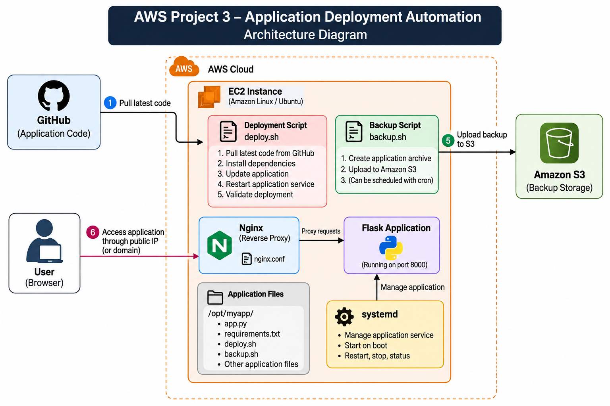

# AWS Project 3 – Application Deployment Automation

## Project Overview

This project demonstrates application deployment and basic automation on an AWS Linux EC2 server.

The project uses:

- AWS EC2
- Linux
- Git/GitHub
- Python Flask
- Nginx
- systemd
- Bash scripting
- Amazon S3

The objective is to deploy an application on an EC2 server, configure Nginx as a reverse proxy, manage the application using systemd, automate deployment using a Bash script, and create application backups in Amazon S3.

## Architecture


```text
                    GitHub
                       |
                       v
              +----------------+
              |   AWS EC2      |
              |  Linux Server  |
              +----------------+
                       |
              +--------+--------+
              |                 |
              v                 v
          Nginx             systemd
       Reverse Proxy           |
              |                v
              |          Flask Application
              |                |
              +-------<--------+
                       |
                       v
                    Browser


              Backup Flow
              
          EC2 Application
                |
                v
           backup.sh
                |
                v
          Amazon S3 Bucket

AWS Infrastructure
EC2 Instance

An Amazon Linux EC2 instance was used as the application server.

The EC2 server hosts:

Flask application
Nginx
systemd service
Deployment script
Backup script

Application Deployment

A Flask web application was deployed on the EC2 Linux server.

The application was configured to run as a background service using systemd.

The application was accessed through Nginx after configuring Nginx as a reverse proxy.

Nginx Configuration

Nginx was configured as a reverse proxy in front of the Flask application.
Browser
   |
   v
Nginx
   |
   v
Flask Application
Nginx receives HTTP requests and forwards them to the Flask application running on the EC2 server.

Reverse Proxy Validation

The Nginx reverse proxy configuration was tested to verify that requests were successfully reaching the Flask application.

Nginx Recovery

Nginx service failure was intentionally tested.

The Nginx service was stopped and subsequently recovered to verify that the web server could be restored successfully.

systemd Service Management

The Flask application was configured as a Linux systemd service.

systemd was used to manage the application service.

The service can be:

Started
Stopped
Restarted
Checked for status
Recovered after failure
Service Validation

The application systemd service was checked to verify that the Flask application was running correctly.

systemd Recovery

The application service was intentionally stopped and then recovered.

This validated the service management and recovery process.

Deployment Automation

A Bash deployment script was created to automate the application deployment process.

The deployment process includes:

Obtaining the application code
Installing required dependencies
Updating the application
Restarting the application service
Validating the deployment

The deployment script was executed successfully.

Backup Automation

A Bash backup script was created to automate application backups.

The backup process creates an archive of the application files before uploading the backup to Amazon S3.

Backup Validation

The backup script was executed successfully and the backup process was verified.

Amazon S3 Backup

Amazon S3 was used to store application backups.

The backup flow is:

Application Files
       |
       v
   backup.sh
       |
       v
 Backup Archive
       |
       v
   Amazon S3

The generated backup was uploaded and verified in the S3 bucket.

Validation

The following components and workflows were validated during the project.

Application Validation
Flask application was deployed successfully
Application was accessible through Nginx
Nginx successfully forwarded requests to the application
Nginx Validation
Nginx reverse proxy configuration
Nginx service status
Nginx failure and recovery
systemd Validation
Application service status
Application service management
systemd failure and recovery
Deployment Validation
Deployment script execution
Application update
Application service restart
Deployment success verification
Backup Validation
Backup script execution
Backup archive creation
S3 upload
S3 backup verification
Failure Testing

Failure testing was performed to verify application recovery and troubleshooting procedures.

Nginx Failure

The Nginx service was intentionally stopped.

The service was subsequently recovered and the application was tested again.

Application Service Failure

The Flask application systemd service was intentionally stopped.

The service was recovered and the application was validated again.

Recovery Validation

After the services were recovered, the application was checked through Nginx to verify that the deployment was operational.

Troubleshooting

Issues investigated during the project included:

Application service problems
Nginx reverse proxy configuration
Nginx service failure
systemd service failure
Application connectivity
File and directory permissions
Deployment problems
Backup execution
S3 backup verification

The troubleshooting process followed:

Problem
   ↓
Symptoms
   ↓
Investigation
   ↓
Root Cause
   ↓
Fix
   ↓
Validation
Git and GitHub

GitHub was used to store and manage the application source code and project documentation.

The deployment workflow used the application source code from GitHub and deployed it to the AWS EC2 server.

Technologies Used
Technology	Purpose
Amazon EC2	Application server
Linux	Server operating system
Python / Flask	Web application
Nginx	Reverse proxy
systemd	Application service management
Bash	Deployment and backup automation
Git / GitHub	Source code management
Amazon S3	Backup storage
What I Learned
How to deploy a Flask application on Amazon EC2
How to manage Linux applications using systemd
How to configure Nginx as a reverse proxy
How to use Bash scripts for deployment automation
How to create automated application backups
How to upload backups to Amazon S3
How to troubleshoot Linux application services
How to test service failures and recovery
How Git and GitHub can be used in an application deployment workflow
How to validate an application after deployment
Project Status
 EC2 application server
 Linux environment
 Flask application
 Nginx reverse proxy
 Nginx validation
 Nginx failure testing
 Nginx recovery
 systemd service
 systemd validation
 systemd failure testing
 systemd recovery
 Deployment automation
 Backup automation
 Amazon S3 backup
 Failure testing
 Troubleshooting
 Documentation
